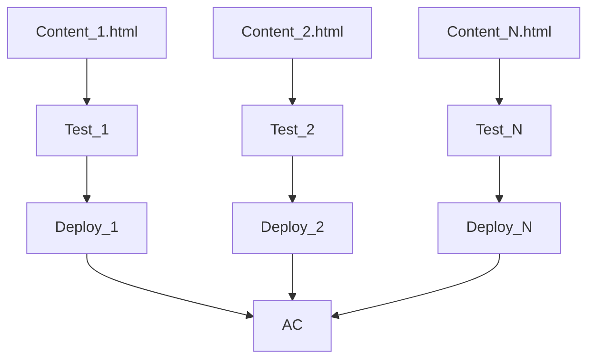
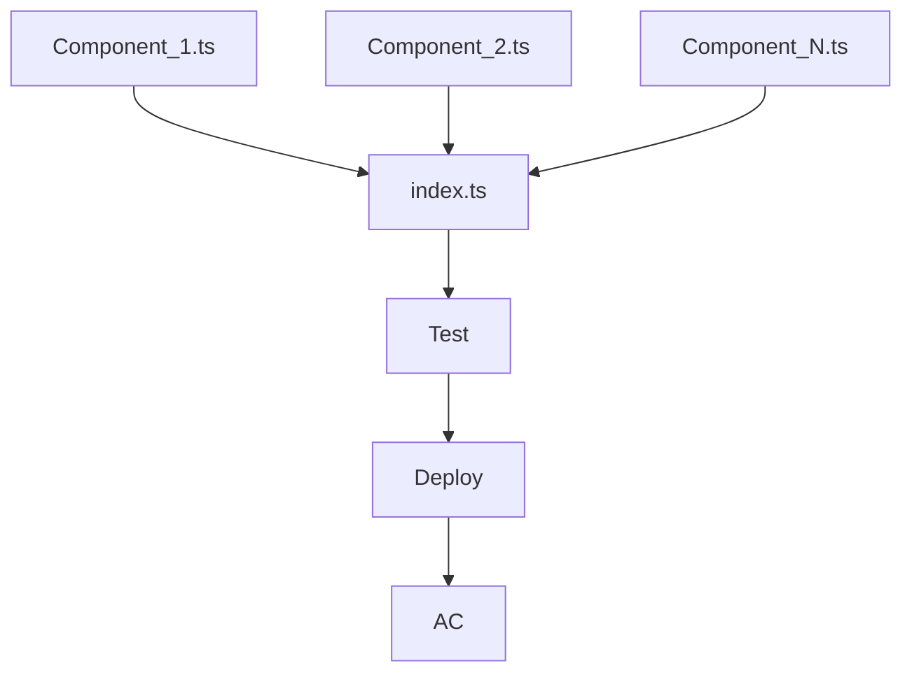

# Market UI Lib

Библиотека была разработана для унификации кодовой базы и ускорение разработки новых маркетинговых контентов.

## Запуск приложения
1. Скопировать репозиторий
    ```bash
    git clone git@github.com:Zakhar-90/mark-ui-lib.git
    ```
2. Перейти в папку mark-ui-lib, если при клонировании не указывали иное, иначе перейти в папку указанную при клонировании репозитория
    ```bash
    cd mark-ui-lib
    ```
3. Установить зависимости, например с помощью nmp
    ```bash
    npm install
    ```
4. Выполнить команду:
    1. Для разработки
        ```bash
        npm run dev
        ```
    2. Для билда приложения
        ```bash
        npm run build
        ```

## Итог
По итогу разработки получил новый процесс разработки маркетинговых контентов
### Вместо



### Получили

###### В результате получил процесс:
- упрощающий тестирование
- позволяющий писать unit-тесты
- упрощающий деплой изменений на стенды
- уменьшающий время на разработку новых контентов

Как итог время разработки одного контента сократилось на 60%.